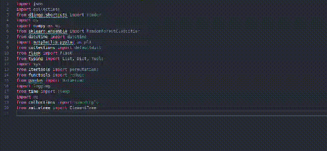

# import-sorter

**Simple extension to sort your imports:**<br>
- Sort your imports by line length for a nicer look and feel.

## Features

Use the command sort imports or use the shortcut ctrl+alt+I to sort all imports in your python file



## Keyboard Shortcuts

This extension provides the following default keyboard shortcuts:

- `Ctrl+Alt+I` (Windows/Linux) or `Cmd+Alt+I` (Mac): Run the import sorter command.

### Customizing Shortcuts

You can customize the keyboard shortcuts by modifying the keybindings in your **keybindings.json** file.

1. Go to **File > Preferences > Keyboard Shortcuts** or press `Ctrl+K Ctrl+S`.
2. Search for `importSorter.sortImports`.
3. Right-click the command and select **Change Keybinding**.
4. Enter your preferred key combination.

Alternatively, you can edit the **keybindings.json** file directly:

```json
{
    "key": "Ctrl+Shift+I",
    "command": "importSorter.sortImports",
    "when": "editorTextFocus"
}
```

## Supported Fonts and Languages

Supports only python with monospaced fonts. Other languages coming soon!

## Release Notes

### 1.0.0
Initial Release

## Credits
Developed by [Youssef Tarek](https://github.com/Youssef1241/import-sorter)